
# SBEN424-Advanced-CV-Lab-05-Template

### Contribution:
- Ahmed Ragab
- Mohamed Ahmed
---
## Part I - Feature Vetor

&nbsp;
## Part II - Region Growing
In this Report we test 4 images [feli.tif](./Captures/feli.tif), [hand2.tif](./Captures/hand2.tif), [mosaic8.tif](./Captures/mosaic8.tif), and [pingpong2.tif](./Captures/pingpong2.tif).
For each image we generate four images first  with added two planes, then two different images with only one plane for each image, and last one is without any added planes.

### **2.1. feli.tif**
| **1-Image without any Added Planes** | **2-Image with Added Two Planes** |
|:-------------:|:-------------:|
| 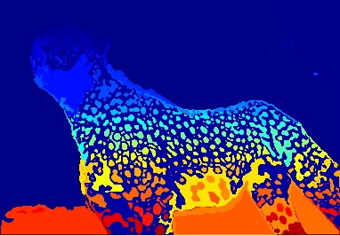 | 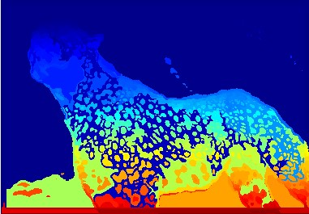|

| **3-Image with only one plane** | **4-Image with another Plane** |
|:-------------:|:-------------:|
| 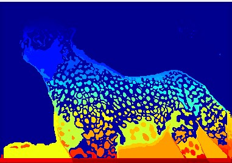 | 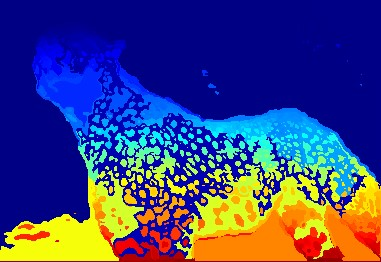|

> Comment: As shown, First image without adding any planes got slightly the best result as it separted the object from the background without overfitting also we can differentiate the boundaries of the object from backgorund

&nbsp;
### **2.2. hand2.tif**
| **1-Image without any Added Planes** | **2-Image with Added Two Planes** |
|:-------------:|:-------------:|
| 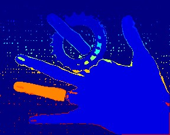 | 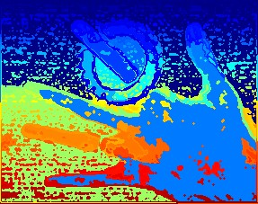|

| **3-Image with only one plane** | **4-Image with another Plane** |
|:-------------:|:-------------:|
| 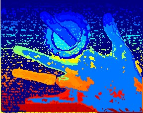 | 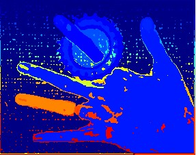|

> Comment: As Shown First and Fourth Images got the best results. but, First image got better results compared to fourth as Hand appears as one object except one finger in both images. So, First Image without adding any Planes got best result as we can differentiate that there are 3 objects (Hand, Rotating Circle suspended with Finger, and the background) but It detects one finger as a whole object which is false.

&nbsp;
### **2.3. mosaic.tif**
| **1-Image without any Added Planes** | **2-Image with Added Two Planes** |
|:-------------:|:-------------:|
| 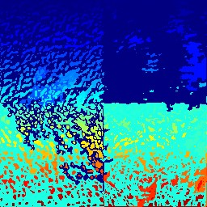 | 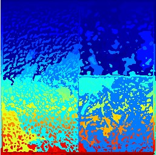|

| **3-Image with only one plane** | **4-Image with another Plane** |
|:-------------:|:-------------:|
| 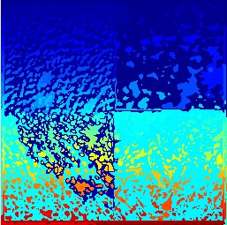 | 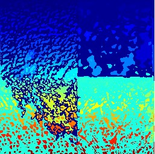|

> Comment: As the image is separated into four quarters it's difficult to tell that there is a best result for the four quarters (whole image) since each result gives the best result for specific quarters. But, We can choose the Third Result (Image with only one plane) is the best because it differentiates between the four quarters in a good way as the rest result images make two quarters as one object this clearly appears in the first image that mix the objects in the upper right quarter with lower right quarter also appears in the second result image that mix (can't differntiate) between upper two quarters.

&nbsp;
### **2.4. pingpong2.tif**
| **1-Image without any Added Planes** | **2-Image with Added Two Planes** |
|:-------------:|:-------------:|
| 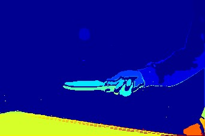 | 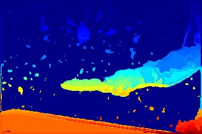|

| **3-Image with only one plane** | **4-Image with another Plane** |
|:-------------:|:-------------:|
| 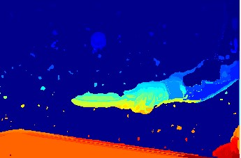 | 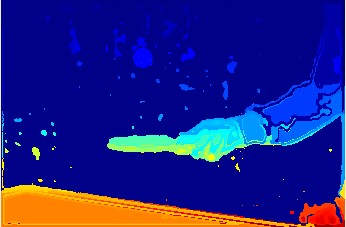|

> Comment: First Image without adding any planes got the best results as we can fine differntiate between the objects in the image (Hand, ping-pong paddle, ball, table, and the background)